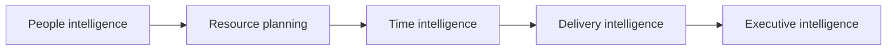
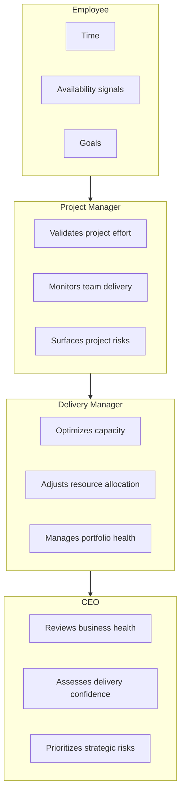
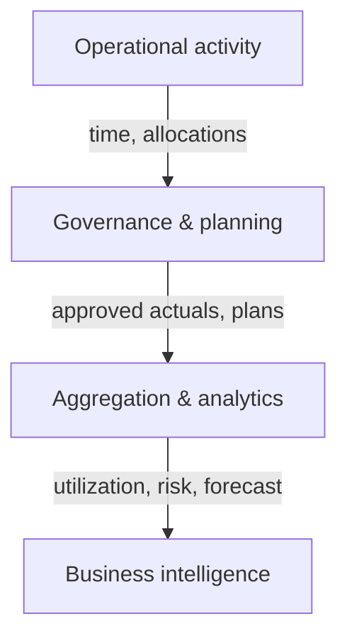
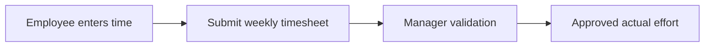
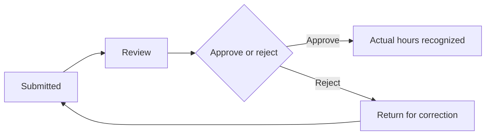
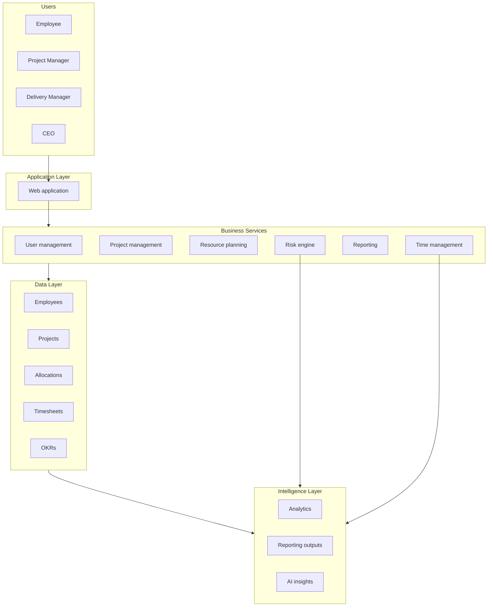
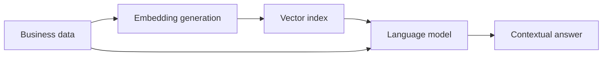
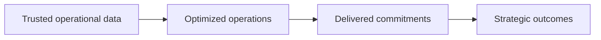
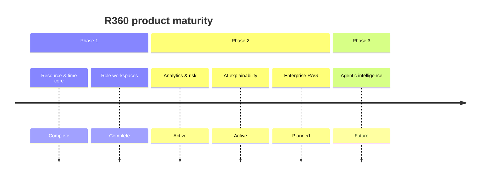

# R360 — Resource Intelligence & Delivery Management Platform

## Role-Based Knowledge Transfer Guide

**Document type:** Enterprise product knowledge transfer (post-session reference)  
**Audience:** Employee · Project Manager · Delivery Manager · CEO  
**Perspective:** Principal Engineer / Solution Architect  
**Last updated:** June 2026

---

This guide explains R360 as an **enterprise SaaS platform**: the business problems it addresses, how each role contributes and consumes intelligence, what decisions the platform enables, and how operational activity becomes leadership insight. It is intended for **sharing after a knowledge transfer session** — not as a demo script, user manual, or technical runbook.

---

## Section 1 — R360 Platform Overview

### What is R360?

**R360** is an **enterprise resource intelligence and delivery management platform** that connects **people, projects, capacity, time, delivery health, and AI-driven insights** in a single governed system.

Organizations use R360 to move from fragmented spreadsheets and delayed reporting to a **continuous operating picture** of who is doing what, whether delivery is on track, and where leadership must intervene.

### Why organizations need R360

Modern delivery organizations face recurring structural challenges:

| Challenge | Typical consequence |
|-----------|---------------------|
| **Resource visibility gaps** | Staffing decisions made without knowing true availability |
| **Dependency on spreadsheets** | Version drift, manual consolidation, audit weakness |
| **Manual capacity planning** | Slow response to new deals; over- or under-commitment |
| **Lack of project health visibility** | PMs and executives learn about problems too late |
| **Delayed risk identification** | Risks surface at billing, milestone, or client escalation |
| **Poor utilization tracking** | Bench waste, burnout, and margin erosion go undetected |
| **Difficulty in executive reporting** | Leadership receives lagging, inconsistent narratives |

R360 addresses these at the **operating model** level — not by adding another task tracker, but by owning **resource and delivery intelligence**.

### How R360 solves these problems

| Capability | What it delivers | Business value |
|------------|------------------|----------------|
| **People intelligence** | Who is available, allocated, skilled, and committed | Staff with confidence; reduce hidden overload |
| **Resource planning** | Planned effort by person, project, and week | Optimize staffing before delivery breaks |
| **Time intelligence** | Governed capture and approval of actual effort | Convert daily work into trusted actual data |
| **Delivery intelligence** | Risk signals from staffing, plan, and actuals | Identify issues before customer impact |
| **Executive intelligence** | Portfolio health, utilization, and strategic risk | Enable leadership decisions on real-time insight |

### Why R360 is different

R360 is **not** a task management tool like Jira, Azure DevOps, or similar systems. Those tools excel at **work items and sprints**; R360 excels at **resource and delivery economics**.

| R360 focuses on | Not primary focus |
|-----------------|-------------------|
| Resource intelligence | Individual task boards |
| Delivery management | Bug tracking |
| Capacity planning | Sprint ceremonies |
| Utilization and bench | Document collaboration |
| Executive visibility | Engineering workflow automation |

R360 **complements** delivery tools: tasks may live elsewhere; **who is staffed, for how long, at what cost, and with what risk** lives in R360.

### Value chain (conceptual)

Each layer depends on the quality of the one before it. **Approved time** and **accurate allocations** are the foundation of everything upstream.

---

## Section 2 — R360 Operating Model

### How information flows through the organization

R360 implements a **closed loop** from operational truth to strategic action. Every role both **contributes data** and **consumes intelligence** appropriate to their scope.

| Role | Provides / validates | Consumes |
|------|----------------------|----------|
| **Employee** | Time, availability context, goal progress | Own assignments, workload, OKR alignment |
| **Project Manager** | Effort validation, execution status, project risks | Team roster, plan vs actual, project health |
| **Delivery Manager** | Allocation decisions, portfolio interventions | Capacity, utilization, cross-project risk |
| **CEO** | Strategic priorities (via OKRs and decisions) | Portfolio confidence, workforce intelligence, risk radar |

### Core principle

> **Every role contributes data and consumes intelligence.**

- Employees supply **ground truth** for effort.  
- PMs supply **governance** so actuals are trustworthy.  
- DMs supply **optimization** so the portfolio is deliverable.  
- CEOs supply **direction** while R360 supplies **evidence**.

### From operations to business intelligence

**Operational data** (time entries, allocations) becomes **business intelligence** (utilization trends, delivery confidence, capacity gaps) only after **role-appropriate validation and aggregation**.

---

## Section 3 — Employee Knowledge Transfer

### Role definition

**Employees are the source of operational truth in R360.**

Without accurate, timely contribution from the workforce, downstream metrics — project costing, utilization, forecasts, and executive dashboards — lose integrity. Employee participation is therefore a **governance responsibility**, not administrative overhead.

### Employee responsibilities in R360

#### 1. Time management

Employees record **what work was performed**, **for which engagement**, **how many hours**, and **sufficient context** for managers to validate.

| Activity | Purpose |
|----------|---------|
| Daily time entry | Maintains granular, auditable effort record |
| Project selection | Ensures effort rolls up to correct customer / engagement |
| Work description | Supports approval, client governance, and dispute resolution |
| Weekly submission | Formalizes the period for manager validation |

**Business impact of accurate timesheets**

| Enabled outcome | Why it matters |
|-----------------|----------------|
| **Project costing** | Margin and budget tracking per engagement |
| **Utilization calculation** | Organization knows billable vs non-billable load |
| **Delivery forecasting** | Plan vs actual trends inform future staffing |

**Governance workflow (conceptual)**

Until effort is **approved**, it remains provisional — it does not fully inform utilization, planner actuals, or executive metrics.

**Decisions employees enable (for themselves and the org)**

- Choosing correct project attribution when work spans engagements  
- Submitting complete weeks so approval cycles are predictable  
- Responding to rejection feedback to maintain data quality  

#### 2. Project commitment visibility

Employees can see **assigned projects**, **allocation percentage**, and **expected commitment** for their workload.

**Business value**

| Value | Explanation |
|-------|-------------|
| **Workload awareness** | See when total commitment exceeds sustainable capacity |
| **Better planning** | Align personal schedule with project expectations |
| **Transparency** | Reduce disputes about “what I was supposed to work on” |

#### 3. Goal alignment

Employee **objectives and OKRs** connect individual contribution to organizational priorities.

**Business value**

- Aligns daily effort with strategy  
- Supports performance conversations with evidence from the same platform that tracks delivery  
- Gives employees line of sight beyond a single project  

### Employee — summary

| Dimension | Position |
|-----------|----------|
| **Primary question** | *What am I working on, and is my contribution visible?* |
| **R360 role** | Source of operational truth |
| **Accountability** | Accurate, timely time and goal data |

---

## Section 4 — Project Manager Knowledge Transfer

### Role definition

**The Project Manager is the project execution owner.**

PMs are accountable for delivering engagements on behalf of the organization. In R360, they **validate effort**, **monitor delivery health**, and **escalate resource and risk issues** — they do not typically own org-wide capacity.

### PM responsibilities in R360

#### 1. Project staffing visibility

**Business question:** *Do I have the right resources?*

PMs analyze:

| Dimension | What PM assesses |
|-----------|------------------|
| Team availability | Who is free, committed, or overallocated |
| Current allocation | % and hours planned on the engagement |
| Project requirements | Skills and headcount the delivery needs |
| Skill alignment | Whether assigned people match the work |

**Enterprise example**

| Element | Situation |
|---------|-----------|
| **Project** | Mobile banking application |
| **Requirement** | Two mobile developers for core build phase |
| **Current state** | One developer allocated at full capacity |
| **Risk** | Schedule slip, quality pressure, client dissatisfaction |
| **PM action** | Escalate to Delivery Manager for additional allocation; negotiate scope or timeline with client if gap persists |

PMs **consume** staffing intelligence and **initiate** corrective action; portfolio-level rebalancing is typically a DM decision.

#### 2. Timesheet governance

**Business question:** *Is the recorded effort correct?*

PMs validate that submitted effort is:

- Attributed to the **correct project**  
- **Reasonable in hours** for the period  
- Supported by **adequate work description** where policy requires it  

**Approval lifecycle**

**Governance principles**

- **Separation of duties:** PMs do not approve their own effort; another manager or delegate must validate.  
- **Rejection with reason:** Corrections are faster when feedback is explicit.  
- **Approved = trusted:** Only approved effort feeds plan-vs-actual and utilization at scale.

**Decisions PMs make**

- Approve routine, compliant submissions  
- Reject miscoded or insufficiently documented effort  
- Identify systemic miscoding patterns for process improvement  

#### 3. Project risk management

**Business question:** *Will my project deliver successfully?*

R360 surfaces **delivery risk indicators** derived from staffing and execution data, including:

| Indicator | Interpretation |
|-----------|----------------|
| Resource shortage | Planned or actual staffing below need |
| Allocation mismatch | Wrong skills or % on engagement |
| Plan vs actual deviation | Team consistently over or under plan |
| Capacity stress | Key people overallocated across portfolio |

**Project health concept**

A **project health score** (composite, not a single button) reflects factors such as:

- Resource availability vs requirement  
- Planned capacity for the period  
- Approved actual effort vs plan  
- Active delivery risk signals  

PMs use health and risk views to **prioritize stand-ups, client communication, and escalation** — not to replace judgment.

**Decisions PMs make**

- Intervene on execution (scope, priorities, internal review)  
- Escalate resource gaps to DM  
- Adjust stakeholder messaging based on evidence  

### Project Manager — summary

| Dimension | Position |
|-----------|----------|
| **Primary question** | *Will my project deliver?* |
| **R360 role** | Execution owner and effort governor |
| **Accountability** | Validated actuals, visible project health |

---

## Section 5 — Delivery Manager Knowledge Transfer

### Role definition

**The Delivery Manager owns portfolio execution and resource optimization.**

DMs operate **across projects** within a defined **portfolio** — balancing demand, supply, and risk so the organization can honor its commitments without chronic overload or bench waste.

### DM responsibilities in R360

#### 1. Capacity planning

**Business question:** *Can the organization deliver future commitments?*

DMs perform **demand vs supply** analysis at portfolio (and often organizational) scale.

**Enterprise example**

| Metric | Value |
|--------|------:|
| Future demand (planned work) | 5,000 hours |
| Available capacity | 4,200 hours |
| **Gap** | **800 hours** |

**Possible actions**

| Action | When appropriate |
|--------|------------------|
| **Resource movement** | Short gap, fungible skills, shift between projects |
| **Hiring** | Sustained demand, strategic accounts |
| **Contractor engagement** | Time-bound spike, specialized skills |
| **Timeline adjustment** | Client flexibility, descope, phased delivery |

**Decisions DMs make**

- Which projects receive incremental capacity  
- When to trigger workforce planning vs negotiate delivery dates  
- How to protect critical accounts under constraint  

#### 2. Resource optimization

**Business question:** *Are resources balanced?*

DMs identify:

| Pattern | Risk |
|---------|------|
| **Overallocated resources** | Burnout, quality defects, missed dates |
| **Underutilized resources** | Margin leakage, bench cost |
| **Skill gaps** | Delivery risk on specialized engagements |

**Enterprise example — imbalance**

| Resource | Project A | Project B | **Total** |
|----------|----------:|----------:|----------:|
| Developer A | 100% | 40% | **140%** |

**Risk:** Unsustainable load; predictable slip on one or both engagements.

**After optimization (target state)**

| Resource | Project A | Project B | **Total** |
|----------|----------:|----------:|----------:|
| Developer A | 80% | 40% | 120% |
| Developer B | — | 40% | 40% |

**Decisions DMs make**

- Edit planned allocation and weekly hours  
- Pair with PMs on priority when trade-offs exist  
- Use reports to prove optimization to leadership  

#### 3. Portfolio risk management

**Business question:** *Which projects need attention?*

**Portfolio health framing**

| Health | Meaning | Typical response |
|--------|---------|----------------|
| **Green** | Staffed adequately; plan and actual aligned; no critical risks | Monitor |
| **Yellow** | Emerging gap, utilization stress, or trend concern | DM intervention this cycle |
| **Red** | Material threat to delivery, client, or margin | Leadership attention; recovery plan |

DMs consume **command-center style intelligence** and **suggested actions** (where enabled) to prioritize portfolio interventions.

### Delivery Manager — summary

| Dimension | Position |
|-----------|----------|
| **Primary question** | *Can we deliver our commitments?* |
| **R360 role** | Portfolio optimizer |
| **Accountability** | Balanced capacity, visible portfolio health |

---

## Section 6 — CEO Knowledge Transfer

### Role definition

**The CEO uses R360 for strategic visibility and decision making** — not for operational data entry or timesheet approval.

The CEO workspace answers: *Are we delivering? Are we using our people well? Where must leadership focus?*

### CEO focus areas in R360

#### 1. Delivery confidence

**Purpose:** Understand whether the project portfolio is on track at scale.

**Representative metrics**

| Metric | Illustrative enterprise reading |
|--------|--------------------------------|
| Total active projects | Scale of delivery engine |
| Healthy projects | Engagements on track |
| At-risk projects | Require intervention |
| Delivery confidence score | Composite index from risk, utilization, and trend |

**Example snapshot**

| | Count |
|---|------:|
| Total projects | 120 |
| Healthy | 95 |
| At risk | 25 |

**Decisions CEOs make**

- Which programs receive executive sponsorship  
- Where to reprioritize investment or client exposure  
- When to escalate systemic delivery issues to the board  

#### 2. Workforce intelligence

**Purpose:** Ensure the organization’s **people asset** is deployed effectively.

**Representative metrics**

| Metric | Strategic meaning |
|--------|---------------------|
| Total workforce | Size of delivery capacity |
| Allocation % | How much capacity is committed |
| Utilization | Efficiency of revenue-bearing work |
| Bench capacity | Flexibility vs cost |
| Skill gaps | Future delivery constraints |

**Decisions CEOs make**

- Hiring and workforce investment  
- Partnership or subcontract strategy  
- Pricing and deal appetite given capacity reality  

#### 3. Strategic risk visibility

**Purpose:** See **which programs require leadership attention** before they become crises.

CEOs can understand:

- Programs with resource or timeline pressure  
- Portfolio-wide risk trends  
- Business impact of delivery shortfalls (revenue, client, reputation)  

AI-assisted narratives (where enabled) **summarize** patterns; **accountability** for action remains with leaders.

### CEO — summary

| Dimension | Position |
|-----------|----------|
| **Primary question** | *Where should leadership focus?* |
| **R360 role** | Strategic intelligence consumer |
| **Accountability** | Portfolio-level decisions informed by evidence |

---

## Section 7 — R360 Architecture Overview

*Architect-level explanation for stakeholders who need to understand how the platform is structured — without implementation runbooks.*

### Logical architecture

### Layer responsibilities

| Layer | Responsibility |
|-------|----------------|
| **Users** | Role-based personas with scoped access |
| **Application layer** | Secure, responsive web experience for all personas |
| **Business services** | Domain logic: projects, allocations, time, approval, risk, reports |
| **Data layer** | System of record for people, projects, plans, actuals, goals |
| **Intelligence layer** | Aggregations, exports, narratives, and decision support |

### Architecture principles

| Principle | Meaning for the business |
|-----------|--------------------------|
| **Role-based access control** | Each persona sees only what their job requires |
| **Single source of truth** | One platform for resource and time data — not competing spreadsheets |
| **Human approval workflow** | Actual effort and material changes pass through accountable roles |
| **Scalable SaaS architecture** | Multi-tenant-ready separation of UI, API, and data for enterprise deployment |

### Technology posture (summary)

R360 is delivered as a **cloud-ready SaaS-style application**: a modern web front end, API-backed business services, an operational data store for transactional records, and server-side analytics and AI services. Integrations (e.g. planner import, optional sheet sync) feed the same governed data model.

---

## Section 8 — AI Capabilities

### Guiding principle

> **AI assists decision making; humans remain accountable.**

R360 does not autonomously approve timesheets, reallocate people, or commit the organization to delivery changes. AI **explains**, **prioritizes**, and **summarizes** — leaders and managers **decide**.

### 1. Generative AI

**Use cases in R360**

| Use case | Business benefit |
|----------|------------------|
| Explain project risks | Faster comprehension for PM, DM, CEO |
| Generate delivery summaries | Reduce manual status consolidation |
| Create executive insights | Leadership-ready narratives from live data |

**Example interaction**

| | |
|---|---|
| **Question** | Why is Project Alpha at risk? |
| **AI response (illustrative)** | Project Alpha is elevated risk because resource allocation is below stated requirement, approved actual effort has exceeded plan for multiple periods, and the delivery timeline is approaching with open staffing gaps. |

Responses are grounded in **platform data** (allocations, time, risks) — not generic advice.

### 2. RAG architecture (retrieval-augmented generation)

R360’s intelligence strategy includes **retrieval-augmented generation** over **governed business data** so answers cite organizational context.

**Data sources**

- Projects  
- Employees  
- Allocations  
- Timesheets  
- Risks  
- OKRs  

**Conceptual flow**

**Maturity note:** Narrative and explanation features are **actively used** today; full vector RAG across all domains is part of the **product roadmap** (see Section 10). Risk ranking and approvals remain **deterministic** in core workflows.

### 3. Agentic AI (future direction)

| Agent | Purpose |
|-------|---------|
| **Resource optimization agent** | Recommend resource movement scenarios for DM review |
| **Risk monitoring agent** | Continuously scan portfolio for emerging delivery threats |
| **Executive reporting agent** | Produce periodic leadership summaries with cited evidence |

All agentic capabilities are designed with **human approval gates** and **auditability** — consistent with enterprise SaaS governance.

---

## Section 9 — R360 Business Value Summary

| Role | Main question | R360 value |
|------|---------------|------------|
| **Employee** | *What am I working on?* | **Transparency** — visible assignments, workload, and contribution |
| **Project Manager** | *Will my project deliver?* | **Execution control** — governed effort, team visibility, project risk |
| **Delivery Manager** | *Can we deliver our commitments?* | **Portfolio optimization** — capacity, balance, portfolio health |
| **CEO** | *Where should leadership focus?* | **Strategic intelligence** — confidence, utilization, strategic risk |

### Cross-role value chain

R360’s enterprise value is realized when **every role plays its part** in the chain — employees submit truth, PMs govern it, DMs optimize around it, CEOs decide with it.

---

## Section 10 — Future Roadmap

### Phase 1 — Resource and time management

**Focus:** Foundational system of record and governance.

| Theme | Outcomes |
|-------|----------|
| People and project master data | Single registry for delivery organization |
| Allocation and weekly planning | Planned effort by week and project |
| Time capture and approval | Draft → submit → approve/reject lifecycle |
| Role-based workspaces | Persona-appropriate experiences |
| Reporting foundation | Excel and in-platform previews |

**Status:** Largely delivered — ongoing hardening and portfolio scoping.

### Phase 2 — Analytics and AI insights

**Focus:** From data to decision support.

| Theme | Outcomes |
|-------|----------|
| Utilization and workforce analytics | Trends, heatmaps, executive metrics |
| Delivery risk engine | Automated signals with recommended actions |
| Capacity forecasting | Demand vs supply at portfolio level |
| Generative explanations | Risk narratives, copilot, approval anomalies |
| RAG knowledge layer | Contextual Q&A over governed enterprise data |

**Status:** In progress — analytics and explainability active; RAG depth expanding.

### Phase 3 — Agentic delivery intelligence

**Focus:** Proactive optimization with human oversight.

| Theme | Outcomes |
|-------|----------|
| Optimization agents | Scenario recommendations for staffing |
| Continuous risk monitoring | Alert before threshold breach |
| Executive automation | Scheduled, cited leadership briefings |
| Closed-loop learning | Insight → action → measured outcome |

**Status:** Vision and selective pilots — requires Phase 2 data maturity.

---

## Document control

| Item | Detail |
|------|--------|
| **Primary audience** | Employees, PMs, DMs, CEOs — and stakeholders receiving post-KT materials |
| **Companion docs** | [ROLE_FEATURE_GUIDE.md](./ROLE_FEATURE_GUIDE.md) (feature comparison), [README.md](../README.md) (technical setup for administrators) |
| **Excluded from this guide** | Demo scripts, credentials, navigation maps, troubleshooting — by design |

---

*R360 — Resource Intelligence & Delivery Management Platform*  
*Enterprise SaaS · WeKan Enterprise Solutions*
