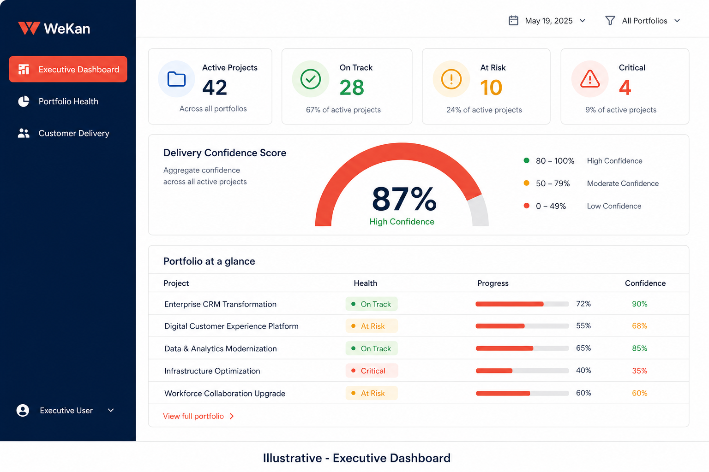
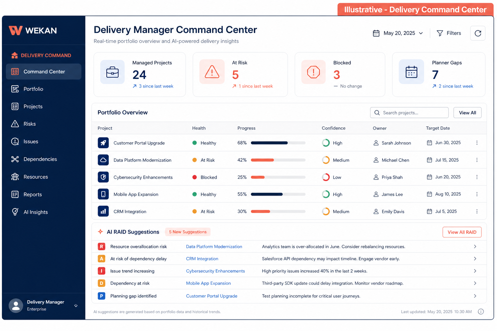
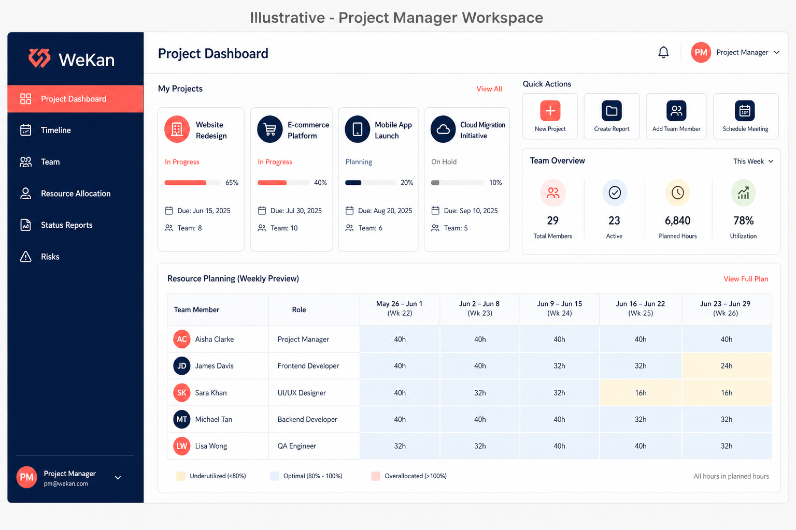
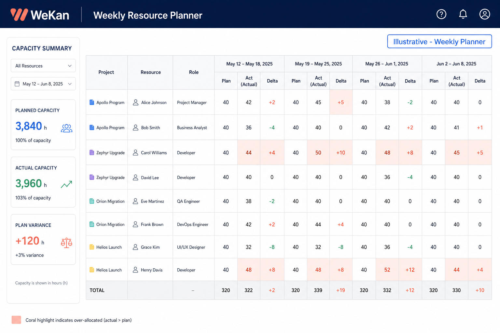

# R360 Role Feature Guide

**Audience:** Project Manager (PM) · Delivery Manager (DM) · CEO  
**Product:** R360 — Resource 360 (WeKan Enterprise Solutions)  
**Last updated:** June 2026

This guide explains what each persona can see and do in R360, module by module. Use it for onboarding, demos, and day-to-day reference.

> **Note on screenshots:** Images in this document are **illustrative wireframes** that show layout and key features. Replace them with live product screenshots from your environment when preparing customer-facing materials (see [Capturing live screenshots](#capturing-live-screenshots)).

---

## Table of contents

1. [Quick start & demo logins](#quick-start--demo-logins)
2. [Role comparison at a glance](#role-comparison-at-a-glance)
3. [Shared concepts](#shared-concepts)
4. [CEO — Executive Command Center](#ceo--executive-command-center)
5. [Delivery Manager — Delivery Command](#delivery-manager--delivery-command)
6. [Project Manager — Project Workspace](#project-manager--project-workspace)
7. [Shared modules (all three roles)](#shared-modules-all-three-roles)
8. [What each role cannot do](#what-each-role-cannot-do)
9. [Google Sheet & data flow](#google-sheet--data-flow)
10. [Capturing live screenshots](#capturing-live-screenshots)

---

## Quick start & demo logins

| Role | Email | Password | Home workspace |
|------|-------|----------|----------------|
| **CEO** | `ceo@r360.com` | `Admin123!` | Executive Command Center |
| **Delivery Manager** | `dm@r360.com` | `Admin123!` | Delivery Command Center |
| **Project Manager** | `pm@r360.com` | `Admin123!` | Project Workspace |
| Admin (reference) | `admin@r360.com` | `Admin123!` | Operations / Admin |

Local app: [http://localhost:5173](http://localhost:5173) (after `npm run dev` in `app/` and `backend/`).

---

## Role comparison at a glance

| Capability | CEO | DM | PM |
|------------|:---:|:--:|:--:|
| View org-wide portfolio & metrics | ✅ | Portfolio only | Own projects |
| Edit resource allocation grid | ❌ Read-only | ✅ Portfolio scope | ❌ View only |
| Weekly planner (plan / actual / delta) | ✅ View | ✅ View | ✅ View |
| Approve timesheets | ❌ | ✅ | ✅ |
| Sync actuals from approved time | ❌ | ❌* | ❌ |
| RAID board & AI suggestions | ❌ | ✅ | Project risks (separate) |
| OKRs | ✅ View / align | ✅ Create | ✅ Create |
| Reports & Excel export | ✅ | ✅ | ✅ |
| AI Executive Brief | ✅ | ❌ | ❌ |
| Google Sheet full sync | ❌ | ❌ | ❌ (Admin only) |

**Legend:** ✅ Full access · 🔶 Scoped · ❌ Not available  

\* **Sync actuals** is currently an **Admin** backend action. DM and PM see actuals after an Admin syncs approved time entries (or when automatic sync runs on approval).

---

## Shared concepts

### Project name = customer name

In R360 and your Google Sheet, the **Project** column (e.g. *Allianz*, *Disney*) is both the project and the customer account. Executive and delivery views show a single **Project** column — not separate Customer + Project fields.

### Three layers of staffing intelligence

| Layer | Source | What it means |
|-------|--------|----------------|
| **Allocation risk** | `Project_Allocation` sheet | Missing team members, inactive allocations |
| **Capacity risk** | Weekly planner | Zero hours, under/over allocation vs capacity |
| **Future capability gap** | Project planning sheet | Forecast only — not current delivery risk |

### Weekly planner columns

For each week, the planner shows:

- **Plan** — planned hours  
- **Act** — approved time entries (actuals)  
- **Δ (Delta)** — actual minus plan (positive = overrun on that project)

---

## CEO — Executive Command Center

  
*Illustrative — Executive Dashboard*

The CEO workspace is **read-only**. It is designed for decision-making, not data entry.

### Navigation (sidebar)

| Module | Path | Features |
|--------|------|----------|
| **Executive Dashboard** | `/executive` | Company delivery health KPIs, delivery confidence score, portfolio snapshot table |
| **Portfolio Health** | `/executive/portfolio-health` | Full portfolio grid — filter by project & health (Green / Amber / Red) |
| **Customer Delivery** | `/executive/customer-delivery` | One card per active project (project name = customer) with health & escalations |
| **Strategic Capacity** | `/executive/capacity` | Workforce capacity forecast, bench, hiring risk signals |
| **OKR Alignment** | `/okrs` | Organization objectives and key results |
| **Risk Radar** | `/executive/risk-radar` | Current delivery risks from allocation + planner with recommended actions |
| **Reports** | `/reports` | Excel report previews and downloads |
| **AI Executive Brief** | `/executive/brief` | AI-generated narrative summary of company delivery health |

### Executive Dashboard — key features

- **Company Delivery Health** — active projects, on track, at risk, critical counts  
- **Resource Health** — total workforce, utilization %, bench capacity, hiring risk  
- **Delivery Confidence Score** — composite score from plan delivery, risk, and utilization  
- **Portfolio at a glance** — top projects sorted by risk with health, progress, confidence  

### Portfolio Health — key features

- Filter by **project name** and **status** (on track / at risk / critical)  
- Columns: Project, Health, Progress, Delivery Confidence, Risk level, Owner  

### Customer Delivery — key features

- Project-centric cards (not grouped customers — each project is its own account)  
- Health badge, escalation count, upcoming milestone placeholder  

### Risk Radar — key features

- Risks ranked by impact (High / Medium / Low)  
- Linked project name, reason, and recommended action  
- Separates **current delivery risk** from future skill-gap forecasts (see Insights)  

### AI Executive Brief — key features

- Auto-generated narrative briefing  
- Bullet list of leadership talking points  
- Refresh on page load  

---

## Delivery Manager — Delivery Command

  
*Illustrative — Delivery Command Center*

The DM workspace is the **operational cockpit** for a portfolio of projects. DMs can edit allocations for projects in their portfolio scope.

### Navigation (sidebar)

| Module | Path | Features |
|--------|------|----------|
| **Command Center** | `/delivery` | Portfolio KPIs, portfolio table, AI RAID suggestions, quick actions |
| **Portfolio Projects** | `/projects` | Project list and detail for managed portfolio |
| **Milestones** | `/delivery/milestones` | Upcoming milestones per project |
| **Resource Planning** | `/allocation` | **Edit** weekly planned hours (portfolio-scoped) |
| **Capacity Forecast** | `/delivery/capacity` | Available vs committed capacity, per-project confidence |
| **RAID Management** | `/delivery/raid` | Manual RAID board + AI suggestions from planner risks |
| **Approvals** | `/pm-approvals` | Approve / reject team timesheets |
| **Reports** | `/reports` | Excel exports and staffing risk previews |
| **AI Recommendations** | `/delivery/recommendations` | Suggested resource moves to reduce delivery risk |

### Command Center — key features

- **Managed Projects**, **At Risk**, **Blocked**, **Planner Gaps**, **Pending Decisions**, **Upcoming Releases** metrics  
- **Portfolio at a glance** table (scoped to DM portfolio)  
- **AI RAID suggestions** — detect planner risk → recommend → DM approves to RAID board  
- Quick links: Resource Planning, Approvals, AI Recommendations  

### Resource Planning (`/allocation`) — key features

- Weekly grid: project × resource × planned hours  
- **Edit and save** planned hours for portfolio projects  
- Add new allocation rows (project + resource)  
- Saves sync to Weekly Planner and Google Sheet `Project_Allocation` + `Weekly Planner` tabs  
- Over-allocation warnings (40h standard week)  

### RAID Management — key features

- Create / track Risk, Assumption, Issue, Dependency items  
- Filter by RAID type  
- **AI suggestions panel** — approve to pre-fill RAID entries from planner-detected risks  

### Approvals — key features

- Pending timesheets grouped by project and employee  
- Bulk approve / reject with comments  
- AI anomaly hints for unusual approval patterns  

### Capacity Forecast — key features

- Available, committed, and gap hours  
- Per-project delivery confidence with risk reason  
- AI capacity recommendation narrative  

---

## Project Manager — Project Workspace

  
*Illustrative — Project Manager Workspace*

The PM workspace focuses on **delivery execution** for assigned projects.

### Navigation (sidebar)

| Module | Path | Features |
|--------|------|----------|
| **Project Dashboard** | `/pm` | Active projects, team size, at-risk count, quick links |
| **Timeline** | `/pm/timeline` | Project timeline view |
| **Team** | `/pm/team` | Team members on PM’s projects |
| **Resource Allocation** | `/allocation` | View weekly plan grid (**read-only** for PM) |
| **Status Reports** | `/pm/status-report` | Weekly status template per project, export PDF |
| **Risks** | `/pm/risks` | Project-level risk log |
| **Decisions** | `/pm/decisions` | Decision log |
| **Communication** | `/pm/communication` | Stakeholder communication notes |
| **Time & Approvals** | `/time-entry` | Team time view + link to approval flows |

### Project Dashboard — key features

- Active project count, team members, at-risk indicator  
- Project cards linking to project detail  
- Shortcuts: Status Report, Timeline, Team Time  

### Status Reports — key features

- Structured sections: Overall Health, Completed, Planned, Risks  
- One section per active project  
- **Export PDF** (browser print)  

### Resource Allocation (PM view) — key features

- Same weekly grid as DM but **cannot save** plan changes  
- Use this to review team loading; request changes via DM or Admin  

### Time & Approvals — key features

- PM can **approve** team timesheets via `/pm-approvals`  
- Time entry page for reviewing team submissions  

---

## Shared modules (all three roles)

  
*Illustrative — Weekly Planner*

### Weekly Planner (`/weekly-planner`)

| Feature | CEO | DM | PM |
|---------|-----|----|----|
| View plan / actual / delta grid | ✅ | ✅ | ✅ |
| Capacity summary panel | ✅ | ✅ | ✅ |
| Filter by week range, employee, project | ✅ | ✅ | ✅ |
| Edit planned hours | ❌ | Via Allocation | ❌ |
| Sync actuals button | ❌ | ❌* | ❌ |

\* Admin can trigger actuals sync via API; all roles then see updated **Act** and **Δ** in Weekly Planner.

**How actuals appear:** Approved time entries → Admin **sync actuals** → planner **Act** and **Δ** columns update → Google Sheet `Weekly Planner` tab updates.

### Projects (`/projects`)

- Browse project list and open project detail  
- CEO: org-wide · DM: portfolio · PM: assigned projects  
- Project detail: status, billing, skills, allocations, timesheet approvals tab  

### Reports (`/reports`)

| Report | Description |
|--------|-------------|
| Resource View | People-centric allocation view |
| Project View | Project-centric staffing view |
| Resource Analytics | Utilization analytics |
| Role Summary (Hrs / %) | Hours and % by role |
| Bandwidth | Available capacity |
| Overallocated | Over-allocated resources |
| Consolidated History | Historical consolidation |

All three roles can preview in-browser and download `.xlsx` files.

Reports also surface **delivery risk cards** and **future skill-gap forecasts**.

### AI Insights (`/insights`)

- Available to PM, DM, CEO, Admin  
- Dashboard AI narrative, approval anomalies  
- Delivery risk cards and skill-gap forecast cards  
- CEO also has dedicated **AI Executive Brief** (`/executive/brief`)

### OKRs (`/okrs`)

- View organization OKRs (all roles)  
- Create / update OKRs: PM, DM, Admin  

### Resource Intelligence Dashboard (`/dashboard`)

- Legacy management dashboard — utilization heatmap, planned vs actual  
- Accessible to PM, DM, CEO (in addition to persona workspaces)  

---

## What each role cannot do

| Action | CEO | DM | PM |
|--------|-----|----|-----|
| Edit allocation grid | ❌ | ✅ (portfolio) | ❌ |
| Approve timesheets | ❌ | ✅ | ✅ |
| Sync weekly actuals | ❌ | ❌ | ❌ |
| Google Sheet full import | ❌ | ❌ | ❌ |
| User / portfolio admin | ❌ | ❌ | ❌ |
| RAID board (delivery) | ❌ | ✅ | ❌ (project risks only) |

---

## Google Sheet & data flow

```
Google Sheet                          R360 MongoDB                    UI
─────────────                         ─────────────                   ───
Resource tab          ──sync──►       employees
Project tab           ──sync──►       projects
Project_Allocation    ◄──save──►      weekly planned hours (allocation)
Weekly Planner tab    ◄──save──►      plan + actual + delta
```

| Direction | Trigger | Sheets updated |
|-----------|---------|----------------|
| Sheet → R360 | Admin **Inputs** full sync | Resource, Project, Project_Allocation |
| R360 → Sheet | Save allocation / sync actuals | Project_Allocation, Weekly Planner |

**Weekly Planner tab columns:** For each week: `{date} Plan`, `{date} Act`, `{date} Delta` (e.g. `15 Jun Plan`, `15 Jun Act`, `15 Jun Delta`).

---

## Capturing live screenshots

Replace illustrative images with real screenshots from your environment:

1. Start backend and frontend locally (see root `README.md`).  
2. Log in as each persona (`ceo@r360.com`, `dm@r360.com`, `pm@r360.com`).  
3. Capture these pages (suggested filenames):

| Filename | Page | Login |
|----------|------|-------|
| `executive-dashboard.png` | `/executive` | CEO |
| `portfolio-health.png` | `/executive/portfolio-health` | CEO |
| `delivery-command.png` | `/delivery` | DM |
| `allocation-edit.png` | `/allocation` | DM |
| `pm-dashboard.png` | `/pm` | PM |
| `weekly-planner.png` | `/weekly-planner` | Any |
| `pm-approvals.png` | `/pm-approvals` | PM or DM |
| `reports.png` | `/reports` | Any |

4. Save PNG files to `docs/screenshots/` and update image paths in this document.

**Windows:** `Win + Shift + S`  
**Mac:** `Cmd + Shift + 4`

---

## Support & feedback

For access issues (missing menu items, portfolio scope), contact your **R360 Admin**. Admins manage roles in **User Management** and portfolio assignment in **Portfolios**.

---

*WeKan Enterprise Solutions · R360 Resource 360*
