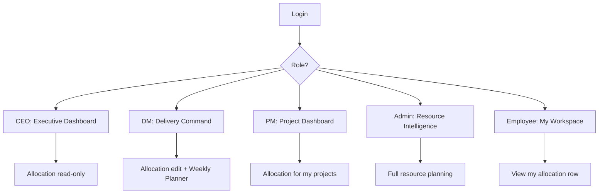

# R360 App Features — Login to Role-Wise

Feature inventory for the R360 web app: authentication, global shell, MVP flags, and capabilities per persona.

**Last updated:** July 2026  
**Default mode:** MVP (`mvpMode` on) — several routes exist in code but are hidden from navigation.

---

## 1. Login & Authentication

| Feature | Details |
|--------|---------|
| **Email/password sign-in** | Standard login at `/login` |
| **Role-based redirect** | After login, users land on their persona home (see below) |
| **Forced password change** | If admin resets password, user is sent to `/account` before dashboard |
| **Change password** | `/account` — any user can update password |
| **Admin password reset** | User Management → **Reset password** generates temp password |
| **No Google OAuth** | Removed from login (email/password only) |

### Home routes after login

| Role | Lands on |
|------|----------|
| CEO | `/executive` |
| Delivery Manager | `/delivery` |
| Project Manager | `/pm` |
| Admin | `/dashboard` |
| Employee / User | `/workspace` |

---

## 2. Global Features (All Roles)

Available in the app shell regardless of role:

- **Dark / light mode** — header + profile menu
- **Global search** — projects & employees (⌘K command palette)
- **Command palette** — role-filtered quick navigation
- **Notifications** — bell icon with unread count
- **AI Copilot** — context-aware prompts per page/role
- **Profile menu** — name, role, account settings, sign out
- **Mobile navigation** — drawer on small screens
- **Breadcrumbs** — page context in header
- **Lazy-loaded routes** — faster initial load
- **Accessible charts** — data table fallback for screen readers

---

## 3. MVP Mode (What’s Hidden)

When `mvpMode` is on (default), these routes are **hidden from nav** even if code exists:

- OKRs, AI Insights, Resource Requests, Admin Approvals
- CEO Risk Radar
- DM Suggested Actions
- PM Timeline, Risks, Decisions, Communication
- Admin Inputs, Portfolios
- **Time Tracking** — hidden when `timeEntryEnabled` is false (default in MVP)
- **Timesheet Approvals** — hidden when `timesheetApprovalEnabled` is false

Feature flags are defined in `app/src/lib/mvp-config.ts` and mirrored from the backend `/api/config/features` endpoint.

---

## 4. Role-Wise Apps

### CEO — Executive Command (`/executive`)

**Nav (MVP):** Executive Dashboard, Portfolio Projects, Resource Allocation, Bench Resources, Skills Matrix, Reports

| Page | Features |
|------|----------|
| **Executive Dashboard** | Company delivery health KPIs, workforce & capacity metrics, AI executive brief, period filters (week/month), portfolio charts, utilization trend, allocation heatmap, risk cards, portfolio table |
| **Portfolio Projects** | Full project list & detail |
| **Resource Allocation** | Read-only **Plan / Act / Δ** weekly grid |
| **Bench Resources** | Under-utilized staff |
| **Skills Matrix** | Org skill coverage (synced from Resource sheet) |
| **Reports** | Operational reports |
| **Risk Radar** | *(full mode only)* |

---

### Delivery Manager — Delivery Command (`/delivery`)

**Nav (MVP):** Command Center, Employees & Projects, Resource Allocation, Weekly Planner, Capacity Focus, Bench, Skills Matrix, Reports

| Page | Features |
|------|----------|
| **Command Center** | Managed projects, at-risk/blocked counts, planner gaps, portfolio charts, portfolio table, AI suggested actions, top recommendations |
| **Employees & Projects** | Project roster & employee directory |
| **Resource Allocation** | Edit planned allocations; org-wide scope in MVP |
| **Weekly Planner** | Multi-week planning grid |
| **Capacity Focus** | Over/under allocation conflicts, employee & project capacity forecast tables |
| **Bench Resources** | Available bench staff |
| **Skills Matrix** | Skill gaps & coverage |
| **Reports** | Delivery reports |
| **Suggested Actions** | *(full mode only)* AI recommendations |

---

### Project Manager — Project Workspace (`/pm`)

**Nav (MVP):** Project Dashboard, All Projects, Team, Resource Allocation, Reports, Skills Matrix

| Page | Features |
|------|----------|
| **Project Dashboard** | My vs org active projects, team size, plan vs actual hours, delta, risk counts, status mix chart, project hours chart, team workload chart, delivery table with risk sort |
| **All Projects** | Projects you manage |
| **Team** | Team members on your projects |
| **Resource Allocation** | Edit allocations for managed projects (MVP-scoped) |
| **Reports** | Status report workspace |
| **Skills Matrix** | Team skill view |
| **Time Tracking** | *(when enabled)* Weekly time entry |
| **Timeline / Risks / etc.** | *(full mode only)* |

---

### Admin — Operations (`/dashboard`)

**Nav (MVP):** Dashboard, Resource Planning, Projects, Time Tracking*, Bench, Skills Matrix, Reports, OKRs*, AI Insights*, User Management, Skill Master, Audit Center, Settings

\*Hidden in MVP

| Page | Features |
|------|----------|
| **Dashboard** | Org KPIs, utilization analytics, project performance grid, heatmap, risk cards, AI workforce insights, period filters, admin ops health strip |
| **Resource Planning** | Full allocation grid — plan & actual editing |
| **Projects** | Full CRUD, team assignment, project detail |
| **User Management** | Employee accounts, role assignment, **password reset** |
| **Skill Master** | Global skills catalog |
| **Audit Center** | Allocation overrides & sync history |
| **Settings** | System health & diagnostics |
| **Inputs / Portfolios** | *(full mode only)* Sheet sync & portfolio setup |

**Removed from Admin nav (MVP):** Approvals

---

### Employee / User — My Workspace (`/workspace`)

**Nav (MVP):** My Workspace, Resource Allocation only

*(OKRs hidden in MVP; Time Tracking & Resource Requests removed from employee nav)*

| Page | Features |
|------|----------|
| **My Workspace** | Redesigned dashboard — **no timesheets** |
| | • Active projects count |
| | • Planned / actual hours this week |
| | • Allocation % & bench capacity |
| | • Plan vs actual charts (week + by project) |
| | • My projects list (status, PM, allocation %, hours) |
| | • Profile card (role, department, skills) |
| | • Notifications |
| **Resource Allocation** | Read-only view of own row in weekly planner |
| **Project detail** | Can open assigned project pages (`/projects/:id`) |
| **Account** | Change password |

**Not available to employees:** Project list page, time entry, resource requests, OKRs (MVP).

---

## 5. Shared Operational Pages (Multi-Role)

| Page | Who can access | Key features |
|------|----------------|--------------|
| **Resource Allocation** `/allocation` | Admin, CEO, DM, PM, Employee | Weekly grid with Plan / Act / Δ; role-based edit vs read-only |
| **Projects** `/projects` | Admin, CEO, DM, PM | List, search, detail, team roster |
| **Skills Matrix** `/skills-matrix` | Admin, CEO, DM, PM | Skill levels from Resource sheet sync |
| **Bench** `/bench` | Admin, CEO, DM | Low-utilization employees |
| **Reports** `/reports` | Admin, CEO, DM, PM | Report workspace |
| **Account** `/account` | All | Password change |

---

## 6. Recent Enhancements (Modernization Cycle)

| Area | What was added/changed |
|------|------------------------|
| **Login** | Removed Google sign-in & footer help text |
| **Password management** | Change password, admin reset, forced change on first login |
| **CEO app** | Executive dashboard with charts, Plan/Act/Δ in allocation |
| **DM app** | Capacity Focus org-wide scope fix; delivery command center |
| **PM app** | Rebuilt dashboard with metrics, charts, delivery table |
| **Employee app** | New workspace (allocation-focused); removed resource requests & time tracking from nav |
| **Admin** | Removed Approvals from nav; dark mode on approval pages |
| **Skills Matrix** | Fixed sync from Resource sheet Skills column |
| **Data integrity** | Project import no longer overwrites PM on every sync |

---

## 7. Quick Role Comparison

---

## Related docs

- [MODERNIZATION_CHECKLIST.md](./MODERNIZATION_CHECKLIST.md)
- [INFORMATION_ARCHITECTURE.md](./INFORMATION_ARCHITECTURE.md)
- [DASHBOARD_REDESIGN.md](./DASHBOARD_REDESIGN.md)
